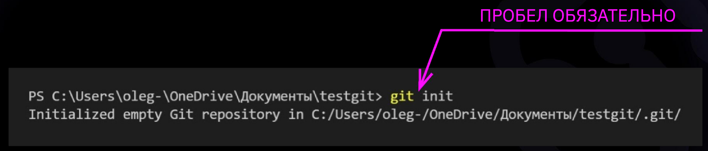
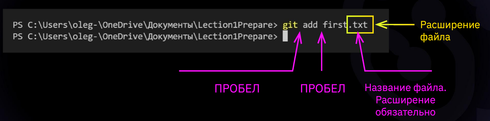

# Инструкция для работы с Git.

## Что такое GIT?

GIT - эта одна из реализаций распределенных систем контроля версий, имеющая как и локальные, так и удалённые репозитории. Является самой популярной реализацией систем контроля версий в мире. 

## Подготовка репозитория

Для создания репозитория необходимо выполнить команду "git init" в папке с репозиторием и у Вас создастся репозиторий (появится скрытая папка .git)

## Создание коммитов

### Git Add
Для добавления изменений в коммит используется команда "git add" . Напишите "git add <имя файла>". 

### Просмотр состояния репозитория
Для того , чтобы посмтотреть состояние репозитория используется команда "git status". Для этого необходимо в папке с репозиторием написать "git status", и Вы увидите были ли изменения в файлах, или их не было.

# Инструкция по работе с Markdown

## Выделение текста

## Списки

## Работа с изображениями

## Ссылки

## Работа с таблицами

## Цитаты

## Заключение